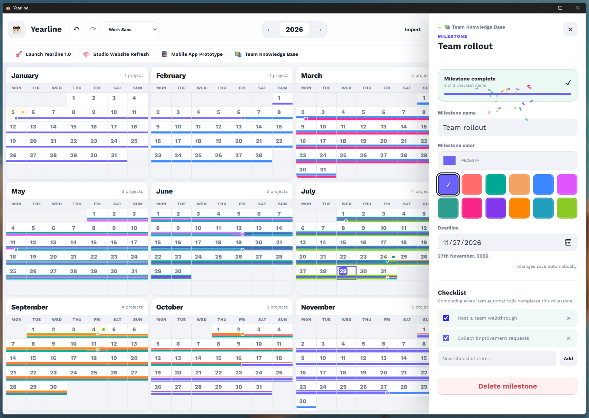

<p align="center">
  
</p>

<h1 align="center">Year Line</h1>

<p align="center">
  A private, offline-first yearly project and milestone planner built using Tauri2 + SQLite.
</p>

<p align="center">
  Plan projects across an entire year, divide them into milestones, track
  checklist progress, and mark important dates from one focused calendar.
</p>

---

## Overview

Yearline presents all twelve months of a year on one screen. Projects appear as continuous milestone timelines across calendar dates, making long-term plans easy to understand without switching between separate monthly views.

Yearline stores its data locally in SQLite. No internet connection or online account is required. This application is not intended for teams.

## Features

- Complete twelve-month calendar view
- Projects identified by customizable emojis
- Multiple milestones for every project
- Draggable milestone date connectors
- Per-milestone checklists
- Completion indicators and confetti
- Custom highlighted dates
- Date-specific project and milestone details
- Undo and redo history
- Real-time activity log
- Light and dark themes
- Adjustable interface scaling
- Ten packaged application fonts
- JSON import and export
- Local SQLite storage
- Offline operation
- Native Windows installer


## Installation

### Windows installer

1. Open the repository's [Releases](https://github.com/rafay-pk/yearline/releases) page.
2. Download the latest Yearline installer.
3. Run the installer.
4. Launch Yearline from the Start menu or desktop shortcut.

Windows may display a warning for unsigned applications. Review the downloaded
file and repository before continuing.

## Demo data

A demonstration dataset can be imported to populate Yearline with sample
projects, milestones, checklists, and highlighted dates.

1. Download [demo-data.json](https://github.com/rafay-pk/yearline/blob/main/demo-data.json)
2. Open Yearline.
3. Select **Import**.
4. Select the demonstration JSON file.

Importing data replaces the current Yearline database. Export a backup before importing when necessary.

## Development

Yearline is built with:
- Tauri 2
- React
- TypeScript
- Vite
- Rust
- SQLite

### Requirements

- Windows 10 or Windows 11
- Node.js
- Rust with the MSVC toolchain
- Microsoft C++ Build Tools
- WebView2

### Clone and install

```
git clone <your-repository-url>
cd yearline
npm install
```

### Run in Development Mode

```
npm run tauri dev
```

### Create a Produciton Build

```
npm run tauri build
```
The Windows installer will be generated under `src-tauri/target/release/bundle/`

# Data and privacy
Yearline does not require an account and does not send calendar information to an external server. Project data is stored locally on the user's computer. 
> Users are responsible for creating JSON backups when moving between computers or reinstalling the application.

# Import and export
Yearline exports projects, milestones, checklist items, project emojis, colors, and special dates into one JSON file. The export contains data from every year, not only the year currently visible in the application.

# Contributing
Bug reports and improvement suggestions are welcome through GitHub Issues. Before submitting a code contribution, open an issue describing the proposed change.